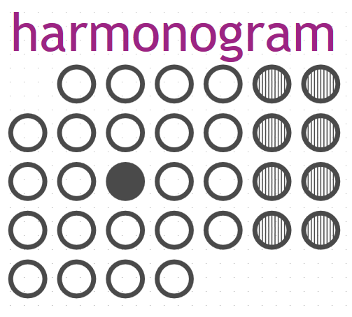

# docs
Dokumentacja projektu harmonogramow

## TODO
+ Stworzenie dokumentacji
+ prototyp na python, w edytorze jupyter, aby 
mozna bylo latwo stworzyc i przetestowac prototyp
+ stworzenie prostych scenariuszy testowych
+ stworzenie kolejnych wersji pozwalajacych na latwe kontrolowanie stanu obecnego 
+ wersje z mozliwoscia odtwarzania poprzednich stanow, naprawiania bledow, anulowania przeliczen
+ budowa API
+ budowa frontendu:
 widok kalendarza, listy, tabeli, drzewa
 mozliwosc dodawania, edytowania
 testy
 

## Zasad dzialania
+ Dane wejsciowe zbierane sa poprzez Formularz
+ Aby wygenerowac dane wyjsciowe, np raport finansowy miesieczny , nalezy stworzyc:
 + wyzwalacz, trigger, co miesiac
 + event, w ktorym polaczy sie miesieczny trigger i projekt
 + projekt, jaki ma byc realizowany, czyli miesieczny bilans w ktorym zawarte jest okreslenie ram danych jakie maja byc poddane analizie, okresla sie dane wejsciowe, czyli te zebrane przez formularz i dane wyjsciowe, czyli generowane przez bilans miesieczny
 
 Termin Input i Termin Output to filtry ograniczajace zakres danych jakie maja byc wygenerowane,
 np w przypadku obliczania SALDO, mozna przedstawic kilka zakresow czasowych, np tylko wydatki w weekendy, albo tylko w nieparzyste dni.
 
 
 

### Ogolny plan

              +------------+
              | EVENT LOGS |
              +-----+------+
                    |
                    |
                +---v----+
          +-----+ EVENT  +----+
          |     +--------+    |
          |                   |
          |                   |
          v                   v
    +-----+----+          +---+-----+
    | TRIGGER  |      +---+ PROJEKT +--+
    +----------+      |   +---------+  |
                      |                |
                      |                |
                      |                |
                      |                |
            +---------v----+     +-----v---------+
            | Termin Input |     | Termin Output |
            +--------------+     +---------------+
            
http://asciiflow.com/

## Interfejs
Aplikacja ma byc prosta do obslugi
poprzez pojedyncze dotkniecie lub przesuniecie palcem po kalendarzu, zarysowanie obszaru kwadratu lub linii na kalendarzu.

## Struktura, Moduly
Frontend, Interfejs
API
Backend, www, desktop

## Baza danych
zawiera 3 podstawowe tabele:
+ projektow
+ wzorcow
+ Input, danych wejsciowych,
+ Output, danych wyjsciowych, przeliczanych w celu wyswietlenia i wykonania dzialan i pokazywania ich w widoku uzytkownika lub raportow.

+ raporty, sumy zbierane co okreslony cykl w celach historycznych i porownawczych
+ mediow, zrodel

https://www.kalendarz-365.pl/ksiezyca/kalendarz-ksiezycowy.html

### Pattern
Tabela wzorcow do zbierania danych,
okreslenie jakie dane beda zbierane
***

### Termin 
Input/Output
Tabela do zbierania danych,
dodawanie danych z formularza lub aktywnych modolow na stronie www/aplikacji

id
Name
Description
UNIT
SALDO
TYPE
Status: modyfikowane, przeniesione, zarchiwizowane, przeliczone, itd

#### Zaleznosci

unit
 + id
 + unit_id // parent id
 + name
 + description
 + factor

SALDO:
 + id
 + name 
 + description
 

TYPE:
 + id
 + name 
 + description
 
 
Status:
 + id
 + name 
 + description
 
 
#### EXAMPLE
UNIT
pieniadze: 
 EUR
 PLN
waga 
 kg
 g

SALDO:
 konto bankowe
 rachunki domowe
 pomiar cisnienia
 

TYP:
 assigned, Przypisany
 used, zuzyty

### Projects, v1
Tabela projektow, 
definicja obliczen danych wejsciowych / wyjsciowych
logika obliczen
mozna w ten sposob implementowac logike dla obliczen dzialan, raportow, godzin, itd
Tworzyc nowe wartosci na podstawie juz istniejacych, podejmowac inne dzialania w zaleznosci do wyniku

metody przeliczania jakie SALDO bedzie uzywane
Jednostki beda przeliczane w locie 
Prezentacja wynikow w tabeli output

#### Example

+ projekt_id
+ name: Oszczednosci
+ descriptions: wykonywanie na koniec miesiaca przeliczenia ile zostalo oszczednosci z wydanych pieniedzy, poprzez sprawdzenie salda wydatkow poniesionych/zaplanowanych

+ data_from_in: 1 April 2019 // current month
+ data_from_out: 1 April 2019
+ data_to_in: 30 April 2019
+ data_to_out: 30 April 2019
+ saldo_in: spendings
+ saldo_out: savings
+ type_in: available
+ type_out: expired
+ unit_in: EUR
+ unit_out: PLN
+ value_factor: 4,2 // value_in: 100 -> value_out: 420
+ status_in: aktywne
+ status_out: obliczone

### Projects, v2

+ projekt_id
+ name: Oszczednosci
+ descriptions: wykonywanie na koniec miesiaca przeliczenia ile zostalo oszczednosci z wydanych pieniedzy, poprzez sprawdzenie salda wydatkow poniesionych/zaplanowanych

+ data_from: 1 April 2019 // current month
+ data_to: 30 April 2019
+ saldo: spendings
+ type: available
+ unit: EUR
+ value_factor: 4,2 // value_in: 100 -> value_out: 420
+ status: aktywne

### Projects, v3

+ project_id
+ name
+ descriptions

-----
###### EXAMPLE
+ projekt_id
+ name: Oszczednosci
+ descriptions: wykonywanie na koniec miesiaca przeliczenia ile zostalo oszczednosci z wydanych pieniedzy, poprzez sprawdzenie salda wydatkow poniesionych/zaplanowanych
+ value_factor: 1 (default)

Inne:
+ Tworzenia arkusza dla pracownikow na nowy miesiac
+ Realizacja planu zmian, jesli ktos zmienil swoj plan i oka

### Project_Termin
moze byc tylko jeden termin, np do ustawiania co roku okreslony

Input-Output
+ projekt_id
+ termin_id
+ termin_type: In/Out

//SETTINGS
+ warunek wykonania tego dzialania: np wartosc nie mniejsza od zera
+ sposob dodania do listy istniejacych: dodaj jako nowy, zamien istniejacy, 
+ typ konwersji wartosci:
  + przepisanie wartosci (1:1) - konwersja z faktorem 1
  + konwersja (factor)
  + ustawienie stalej, okreslonej wartosci (value), dzien tygodnia, data, zaleznie od typu danej
+ value_factor
 

Projekty, Tabela do zbierania danych, Executed,
Kazde wydarzenie oraz wykonanie musi byc rejetsrowane z mozliwoscia odtworzenia stanu poprzedniego danych zaleznych

SALDO:
 konto bankowe
 rachunki domowe
 pomiar cisnienia
 
CALC
 available, pozostaly
 expired, pozostaly niewykorzystany w czasie, roznica +/-
 

### Events, projekt_trigger
Tabela wydarzen odnosnie projektow
+ id
+ projekt_id
+ trigger_id
+ name: comiesieczny raport osczednosci
+ descriptions: comiesieczne wykonywanie raportu osczednosci
+ tags:
+ settings - config data for create event

### Events_logs
+ chenged
+ executed
+ status
+ info

### Trigger, wyzwalacz

 + trigger_id
 + name: comiesieczne
 + type: period_time - jak czesto maja byc wykonywane, czas, period
 + unit: month
 + value: 1
 
 
#### Zaleznosci

type:
 + id
 + name 
 + description

Example
type:
 + time - month
 + user-event 
  + login
  + logout
  + created
  + removed
 + employee
  + hired
  + fired
  + idzie na urlop
  + wraca z urlopu
  

unit
 + id
 + unit_id // parent id
 + name
 + description
 + factor
 

 
 

 

